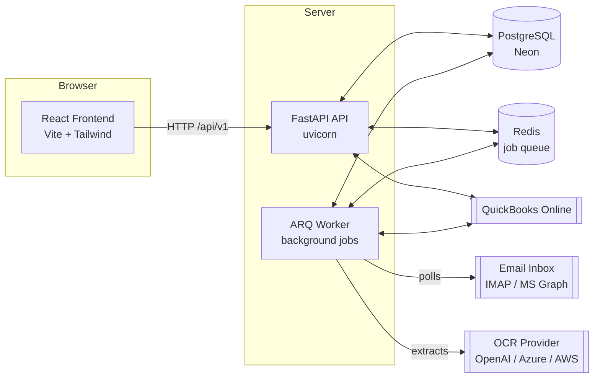
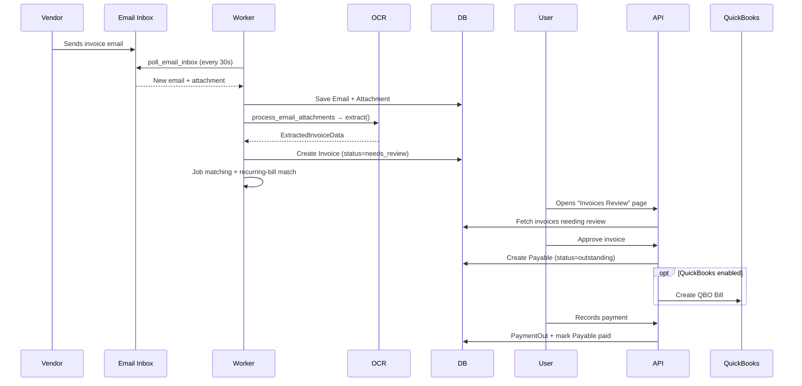

# Bill Processor — Developer Guide

A complete, plain-English walkthrough of how the Bill Processor application is built, how the
pieces fit together, and how to run, change, and deploy it yourself.

This guide is written for a developer (or technical owner) who is taking over the project and
wants to maintain or extend it without prior context. Read the [README](../README.md) first for
the 5-minute setup; this document explains the *why* and *how* behind the code.

---

## Table of Contents

1. [What the App Does](#1-what-the-app-does)
2. [The Big Picture (Architecture)](#2-the-big-picture-architecture)
3. [Repository Layout](#3-repository-layout)
4. [The Backend](#4-the-backend)
   - [Configuration & Secrets](#41-configuration--secrets)
   - [Database Layer](#42-database-layer)
   - [Data Models](#43-data-models-the-database-tables)
   - [Security (Auth & Encryption)](#44-security-auth--encryption)
   - [API Routes](#45-api-routes)
   - [Services (Business Logic)](#46-services-business-logic)
   - [The Background Worker](#47-the-background-worker)
5. [The Frontend](#5-the-frontend)
6. [How a Bill Flows Through the System](#6-how-a-bill-flows-through-the-system-end-to-end)
7. [Database Migrations](#7-database-migrations-alembic)
8. [Running Locally](#8-running-locally)
9. [Testing](#9-testing)
10. [Deployment](#10-deployment)
11. [Common Tasks & Where to Make Changes](#11-common-tasks--where-to-make-changes)
12. [Troubleshooting](#12-troubleshooting)

---

## 1. What the App Does

Bill Processor automates accounts-payable work for a construction company:

1. **Watches an email inbox** (Gmail/IMAP or Microsoft 365/Outlook) for incoming vendor invoices.
2. **Reads the invoice** (PDF/image or even email body text) using OCR/AI and extracts vendor,
   amounts, dates, invoice number, and line items.
3. **Matches the invoice to a job** by learning vendor → job relationships over time.
4. Lets a human **review and approve** each bill, which turns it into a **payable**.
5. Tracks **cash flow** — what's owed, what's coming in (receivables), recurring bills, and the
   "real available" cash after obligations.
6. Optionally **syncs to QuickBooks Online** (sends approved bills as QBO Bills, pulls receivables).

Everything is **multi-user**: each user has their own data, email connection, and settings,
isolated by a `user_id` column on every table.

---

## 2. The Big Picture (Architecture)

The system has **four** running pieces plus a database:



| Piece | Technology | Responsibility |
|-------|-----------|----------------|
| **Frontend** | React 18 + Vite 6 + Tailwind 3 | The UI the user clicks around in. Talks to the API over HTTP. |
| **API** | FastAPI (Python 3.12) | Handles all HTTP requests, auth, reads/writes the database. |
| **Worker** | ARQ (async Redis queue) | Runs scheduled jobs: polls email, runs OCR, generates recurring bills, sends notifications. |
| **Database** | PostgreSQL (Neon) | Stores everything. |
| **Redis** | Redis 7 | Message queue + scheduler that the worker uses. |

> **Key idea:** The **API** is request/response only — it never waits on slow things like email or
> OCR. All slow work happens in the **worker** on a schedule, so the UI always stays fast.

---

## 3. Repository Layout

```
bill-processor/
├── backend/                 # Python / FastAPI API + worker
│   ├── app/
│   │   ├── main.py          # FastAPI app entrypoint, route mounting, /health
│   │   ├── api/             # HTTP route handlers (one file per feature)
│   │   ├── core/            # config, database connection, security helpers
│   │   ├── models/          # SQLAlchemy database tables (models.py)
│   │   ├── schemas/         # Pydantic request/response shapes (schemas.py)
│   │   ├── services/        # business logic (email, OCR, matching, QBO, ...)
│   │   └── workers/         # ARQ background worker (worker.py)
│   ├── alembic/             # database migration scripts
│   ├── tests/               # pytest test suite (uses in-memory SQLite)
│   ├── requirements.txt     # Python dependencies
│   └── Dockerfile
├── frontend/                # React single-page app
│   ├── src/
│   │   ├── App.jsx          # route table
│   │   ├── pages/           # one component per screen
│   │   ├── components/      # shared UI (Layout, NotificationBell, ...)
│   │   ├── hooks/           # useAuth (login/session state)
│   │   └── services/api.js  # all API calls live here
│   ├── nginx.conf           # serves the built app + proxies /api
│   └── Dockerfile
├── docs/                    # guides (incl. this file) + hosted help pages
├── docker-compose*.yml      # local dev, production, and Neon variants
└── *.bat / *.sh             # convenience scripts (Windows / Linux)
```

The loose `.py` scripts in `backend/` (e.g. `check_db.py`, `seed_bills.py`, `debug_*.py`) are
**one-off maintenance/debugging utilities**, not part of the running app. They're safe to ignore
during normal operation.

---

## 4. The Backend

The backend is a [FastAPI](https://fastapi.tiangolo.com/) application. Everything is **async**
(uses `async`/`await`) so a single process can handle many requests while waiting on the database.

### 4.1 Configuration & Secrets

**File:** [backend/app/core/config.py](../backend/app/core/config.py)

All configuration comes from environment variables (loaded from a `.env` file locally). The
`Settings` class lists every setting with a default. Important ones:

| Variable | Purpose |
|----------|---------|
| `DATABASE_URL` | Postgres connection string (must use the `postgresql+asyncpg://` scheme). |
| `SECRET_KEY` | Signs JWT login tokens. Keep secret. |
| `ENCRYPTION_KEY` | Fernet key used to encrypt sensitive settings (email passwords, API keys) in the DB. |
| `REDIS_URL` | Where the worker queue lives. |
| `OCR_PROVIDER` | Which OCR engine to use (`openai`, `azure`, `aws`, or `none`). Usually set per-user from the Settings page instead. |
| `QBO_*` | QuickBooks Online OAuth credentials. |
| `MS_*` | Microsoft 365 OAuth credentials (for Outlook email). |

`get_settings()` is cached (`@lru_cache`) so settings are read once at startup.

> Many runtime settings (OCR provider, email credentials, bank balance) are stored **per-user in
> the database** in the `app_settings` table, *not* in `.env`. The `.env` values are mostly
> infrastructure-level defaults.

### 4.2 Database Layer

**File:** [backend/app/core/database.py](../backend/app/core/database.py)

- Creates the async SQLAlchemy **engine** and **session factory** from `DATABASE_URL`.
- `Base` is the parent class all models inherit from.
- `get_db()` is a FastAPI dependency that hands each request a database session.
- `async_session_factory()` is used by the worker (which has no request to attach to).
- `init_db()` runs at startup to ensure tables exist.

### 4.3 Data Models (the database tables)

**File:** [backend/app/models/models.py](../backend/app/models/models.py)

This single file defines every table. Here's what each one is for:

| Model | Table | What it stores |
|-------|-------|----------------|
| `User` | `users` | Login accounts (username + bcrypt-hashed password). |
| `Email` | `emails` | Every email fetched from the inbox, with a processing `status`. |
| `Attachment` | `attachments` | Files pulled off emails (saved to disk; `file_path` points to them). |
| `Invoice` | `invoices` | The extracted bill: vendor, amounts, dates, line items, status, QBO IDs. |
| `InvoiceLineItem` | `invoice_line_items` | Individual line items on an invoice. |
| `Job` | `jobs` | Construction jobs/projects that invoices get assigned to. |
| `VendorJobMapping` | `vendor_job_mappings` | Learned "this vendor usually belongs to this job" rules. |
| `Payable` | `payables` | An approved bill that is owed. Denormalizes invoice data so it survives invoice deletion. |
| `AppSetting` | `app_settings` | Per-user key/value settings (email config, OCR provider, bank balance...). Encrypted when sensitive. |
| `QBOToken` | `qbo_tokens` | QuickBooks OAuth access/refresh tokens. |
| `MSGraphToken` | `ms_graph_tokens` | Microsoft 365 OAuth tokens. |
| `RecurringBill` | `recurring_bills` | Template for a repeating bill (rent, insurance, etc.) with a frequency. |
| `BillOccurrence` | `bill_occurrences` | A single dated instance generated from a recurring bill. |
| `Notification` | `notifications` | In-app alerts (bill due soon, overdue, low balance...). |
| `ReceivableCheck` | `receivable_checks` | Money expected to come in (from QBO invoices or manual entry). |
| `PaymentOut` | `payments_out` | The check register — money actually paid out. |
| `VendorAccount` | `vendor_accounts` | "Top vendor accounts" tracking (running balances, due dates, links). |

**Enums** at the top of the file define the allowed values for status fields (e.g.
`InvoiceStatus`, `PayableStatus`, `BillFrequency`, `NotificationType`). When you add a new status,
add it to the enum *and* create a migration.

**The invoice status lifecycle:**

```
pending → extracted → needs_review → (approved) → sent_to_qb → paid
                          ↑
                    auto_matched (matched to a job automatically,
                    but still routed to review before approval)
```

**Multi-tenancy:** almost every table has a `user_id` column. Queries always filter by the logged-in
user's id so users never see each other's data.

### 4.4 Security (Auth & Encryption)

**File:** [backend/app/core/security.py](../backend/app/core/security.py)

Three responsibilities:

1. **Password hashing** — `hash_password` / `verify_password` use **bcrypt**. Plain passwords are
   never stored.
2. **JWT tokens** — `create_access_token` / `decode_access_token` issue signed login tokens
   (HS256, signed with `SECRET_KEY`). Default expiry is 7 days. The frontend stores the token in
   `localStorage` and sends it as `Authorization: Bearer <token>` on every request.
3. **Field-level encryption** — sensitive settings (email passwords, OCR/QBO API keys) are
   encrypted with **Fernet** (using `ENCRYPTION_KEY`) before being stored in `app_settings`, and
   decrypted on read. This means a database leak doesn't expose the secrets.

The actual "who is logged in" dependency is `get_current_user` in
[backend/app/api/auth.py](../backend/app/api/auth.py). Protected endpoints declare it as a
dependency and FastAPI rejects requests without a valid token.

### 4.5 API Routes

**Folder:** [backend/app/api/](../backend/app/api/)

Each file is a FastAPI **router** for one feature area. They're all mounted under `/api/v1` in
[backend/app/main.py](../backend/app/main.py):

| Router file | Endpoints handle |
|-------------|------------------|
| `auth.py` | Setup wizard, login, change password, "who am I". |
| `invoices.py` | List/get/update invoices, upload attachments, approve, junk/restore. |
| `jobs.py` | CRUD for construction jobs + vendor→job mappings. |
| `payables.py` | The payables dashboard, bank balance, "real available" cash math. |
| `payments_out.py` | The check register (money paid out). |
| `receivables.py` | Money expected in; pulls from QuickBooks. |
| `recurring_bills.py` | Recurring bill templates and their occurrences. |
| `notifications.py` | List/mark-read in-app notifications. |
| `settings.py` | Read/write per-user settings (email, OCR provider, etc.). |
| `quickbooks.py` | QBO OAuth flow + sending bills. |
| `microsoft.py` | Microsoft 365 OAuth flow for Outlook email. |
| `vendor_accounts.py` | Top vendor accounts table. |
| `junk.py` | The "junk bin" (soft-deleted invoices/jobs). |

**Pattern in every route file:**

```python
router = APIRouter(prefix="/invoices", tags=["invoices"])

@router.get("")
async def list_invoices(
    db: AsyncSession = Depends(get_db),          # database session
    user: User = Depends(get_current_user),       # the logged-in user
):
    # query filtered by user.id, return Pydantic schemas
```

Routes are thin: they validate input (via **schemas**), call a **service** for real logic, and
return results.

### 4.6 Services (Business Logic)

**Folder:** [backend/app/services/](../backend/app/services/)

This is where the real work lives. Services are plain classes that take a `db` session and a
`user_id` and expose methods. Both the API and the worker call them.

| Service | What it does |
|---------|--------------|
| `email_service.py` | Connects to IMAP (Gmail/generic), fetches new mail, saves emails + attachments. |
| `microsoft_graph_service.py` | Same idea but via the Microsoft Graph API (Outlook/365). |
| `ocr_service.py` | **The OCR abstraction.** Defines a common `OCRProvider` interface with implementations for OpenAI Vision, Azure Document Intelligence, AWS Textract, and a no-op. `get_ocr_provider_async()` picks the right one from the user's settings. Returns a normalized `ExtractedInvoiceData`. |
| `job_matching_service.py` | Decides which job an invoice belongs to, using (in order) saved vendor mappings, address matching, job-name matching, and fuzzy vendor matching. Also **learns** from manual assignments so it gets smarter. |
| `payables_service.py` | Turns approved invoices into payables; computes dashboard totals and "real available" cash. |
| `recurring_bills_service.py` | Generates dated occurrences from recurring-bill templates; auto-matches incoming invoices to expected bills. |
| `notification_service.py` | Creates in-app alerts (due soon, overdue, low balance, daily digest). |
| `quickbooks_service.py` | OAuth token refresh + creating QBO Bills / reading QBO data. |
| `receivable_checks_service.py` | Manages expected incoming money. |
| `payments_out_service.py` | The check register logic. |
| `vendor_accounts_service.py` | Top vendor accounts tracking. |
| `buildertrend_service.py` | Imports jobs from a Buildertrend CSV export. |

**The OCR provider pattern** is worth understanding because it's the most "swappable" part:

```python
class OCRProvider(ABC):
    @abstractmethod
    async def extract(self, file_path: str) -> ExtractedInvoiceData: ...

class OpenAIVisionProvider(OCRProvider): ...
class AzureDocumentIntelligenceProvider(OCRProvider): ...
class AWSTextractProvider(OCRProvider): ...
```

To add a new OCR engine, write a new subclass and register it in `get_ocr_provider_async()`. The
rest of the app doesn't change because everyone depends on the common interface and the normalized
`ExtractedInvoiceData` result.

### 4.7 The Background Worker

**File:** [backend/app/workers/worker.py](../backend/app/workers/worker.py)

Run separately with: `arq app.workers.worker.WorkerSettings`

The worker uses **ARQ** (a Redis-backed async task queue) to run jobs on a schedule. The schedule
lives in `WorkerSettings.cron_jobs`:

| Job | Schedule | What it does |
|-----|----------|--------------|
| `poll_email_inbox` | every 30 seconds | For every user, polls IMAP + MS Graph for new mail, then kicks off extraction for each new email. |
| `process_email_attachments` | triggered per email | Runs OCR on each attachment (or the email body), de-duplicates, creates `Invoice` records, runs job matching, and routes to review. |
| `generate_bill_occurrences` | every hour | Creates upcoming `BillOccurrence` rows from recurring-bill templates. |
| `send_daily_digest` | daily at 12:00 | Builds the daily notification digest. |
| `sync_qb_receivables` | every 5 minutes | Pulls receivables from QuickBooks. |

Important details:

- **`_poll_lock`** prevents two email polls from overlapping.
- **De-duplication** happens at three levels: by `message_id` (email), by `attachment_id`
  (don't re-OCR), and by vendor + invoice number + amount (don't create duplicate invoices).
- Newly extracted invoices are always set to **`needs_review`** — even auto-matched ones — so a
  human approves before a payable is created.
- `max_tries = 2` and `job_timeout = 600` mean failed jobs retry once and time out after 10 min.

---

## 5. The Frontend

**Folder:** [frontend/src/](../frontend/src/)

A standard React single-page app built with Vite. Tailwind CSS handles styling (dark theme).

**Routing** — [frontend/src/App.jsx](../frontend/src/App.jsx) defines every screen:

| Route | Page | Purpose |
|-------|------|---------|
| `/login` | `LoginPage` | Sign in. |
| `/setup` | `SetupWizard` | First-run setup (create admin, configure email + OCR). Shown automatically when no user exists. |
| `/` | `DashboardPage` | Cash-flow overview. |
| `/invoices` | `InvoiceListPage` | All extracted invoices. |
| `/invoices/:id` | `InvoiceDetailPage` | One invoice, edit + approve. |
| `/invoices-review` | `InvoicesReviewPage` | Queue of invoices needing review. |
| `/payables` | `PayablesPage` | What's owed + bank balance + real-available cash. |
| `/payments-out` | `PaymentsOutPage` | Check register (money paid). |
| `/payment-history` | `PaymentHistoryPage` | History of payments. |
| `/bills` | `BillsPage` | Recurring bills + occurrences. |
| `/receivables` | `ReceivablesPage` | Money expected in. |
| `/settings` | `SettingsPage` | Email, OCR, QuickBooks, bank balance config. |
| `/junk` | `JunkBinPage` | Soft-deleted items. |

**Auth state** — [frontend/src/hooks/useAuth.jsx](../frontend/src/hooks/useAuth.jsx) is a React
context that tracks whether you're logged in, whether setup is complete, and connection errors.
`ProtectedRoute` redirects to `/login` when you're not authenticated.

**All API calls** go through [frontend/src/services/api.js](../frontend/src/services/api.js). It:

- Creates an `axios` instance with base URL `/api/v1`.
- Automatically attaches the JWT token from `localStorage` to every request.
- On a `401` response, clears the token and redirects to `/login`.
- Exports grouped helpers like `authAPI`, `invoicesAPI`, `payablesAPI`, etc. — **add new endpoints
  here**, then call them from pages.

**Shared components** — `Layout` (sidebar + nav shell), `NotificationBell`, `OverdueAlertBanner`,
`ContextMenu`.

**Serving in production** — the app is built (`npm run build`) into static files served by nginx
([frontend/nginx.conf](../frontend/nginx.conf)), which also proxies `/api` to the backend.

---

## 6. How a Bill Flows Through the System (end-to-end)



1. A vendor emails an invoice.
2. Within 30 seconds the **worker** finds it, saves the email + attachment.
3. The worker runs **OCR** to extract structured data and creates an `Invoice` (`needs_review`).
4. **Job matching** suggests/assigns a job; recurring-bill matching links it to an expected bill.
5. The **user reviews** the invoice in the UI, fixes anything, and **approves** it.
6. Approval creates a **Payable** (and optionally a QuickBooks Bill).
7. When paid, a **PaymentOut** record is created and the payable is marked paid.
8. The **dashboard** reflects updated cash flow throughout.

---

## 7. Database Migrations (Alembic)

**Folder:** [backend/alembic/](../backend/alembic/)

The database schema is version-controlled with [Alembic](https://alembic.sqlalchemy.org/). Each
file in `alembic/versions/` is one schema change.

**When you change a model** in `models.py`, create and apply a migration:

```bash
cd backend

# 1. Generate a migration from your model changes
alembic revision --autogenerate -m "describe your change"

# 2. Review the generated file in alembic/versions/ (always check it!)

# 3. Apply it to the database
alembic upgrade head
```

To undo the most recent migration: `alembic downgrade -1`.

> Always review autogenerated migrations before applying — Alembic sometimes misses enum changes
> or column renames and needs a manual tweak.

---

## 8. Running Locally

See the [README Quick Start](../README.md#quick-start-local-development) for full detail. Summary:

```bash
# 0. Configure
cp .env.example .env        # fill in DATABASE_URL, SECRET_KEY, ENCRYPTION_KEY

# 1. Start Redis (needed by the worker)
docker compose up redis -d

# 2. Backend API (terminal 1)
cd backend
pip install -r requirements.txt
uvicorn app.main:app --reload --port 8000

# 3. Background worker (terminal 2)
cd backend
arq app.workers.worker.WorkerSettings

# 4. Frontend (terminal 3)
cd frontend
npm install
npm run dev                 # http://localhost:5173
```

Generate the two required secrets:

```bash
python -c "import secrets; print(secrets.token_hex(32))"                       # SECRET_KEY
python -c "from cryptography.fernet import Fernet; print(Fernet.generate_key().decode())"  # ENCRYPTION_KEY
```

Then open the frontend — the **Setup Wizard** walks you through creating the admin account and
configuring email + OCR.

**API docs** are auto-generated at `http://localhost:8000/docs` (Swagger UI) — a great way to
explore and test endpoints.

---

## 9. Testing

```bash
cd backend
pip install pytest pytest-asyncio aiosqlite httpx
python -m pytest tests/ -v
```

Tests live in [backend/tests/](../backend/tests/) and run against an **in-memory SQLite** database,
so they need no external services (no Postgres, Redis, or email). They cover auth, invoices, jobs,
payables, settings, QuickBooks, recurring bills, and service logic. Run them before every commit.

---

## 10. Deployment

The app is containerized and can run anywhere Docker runs. Three common paths:

- **Docker Compose (any VPS)** — `docker-compose.yml` (dev) layered with
  `docker-compose.prod.yml` (production). The Neon variant (`docker-compose.neon.yml`) uses a
  hosted Neon database instead of a local Postgres container.
- **Railway.app** — the recommended managed option. Create 3 services (API, Worker, Frontend) from
  the same repo plus a Neon database and Redis. Full step-by-step is in the
  [README](../README.md#deploying-to-railwayapp).
- **DigitalOcean / generic server** — see
  [docs/guide-digitalocean-takeover.md](./guide-digitalocean-takeover.md).

Whatever the host, the moving parts are always the same: **API + Worker + Frontend + Postgres +
Redis**, with the environment variables from [section 4.1](#41-configuration--secrets).

---

## 11. Common Tasks & Where to Make Changes

| You want to... | Do this |
|----------------|---------|
| Add a new API endpoint | Add a route in the relevant `backend/app/api/*.py`, define request/response shapes in `schemas/schemas.py`, put logic in a service, then add a helper in `frontend/src/services/api.js`. |
| Add a new database field | Edit the model in `models/models.py`, run `alembic revision --autogenerate`, review, `alembic upgrade head`. |
| Add a new screen | Create a component in `frontend/src/pages/`, add a `<Route>` in `App.jsx`, add a nav link in `components/Layout.jsx`. |
| Support a new OCR engine | Add an `OCRProvider` subclass in `services/ocr_service.py` and register it in `get_ocr_provider_async()`. |
| Change a scheduled job | Edit `WorkerSettings.cron_jobs` in `workers/worker.py`. |
| Change the invoice approval rules | Look in `api/invoices.py` (approve endpoint) and `services/payables_service.py`. |
| Adjust cash-flow math | `services/payables_service.py` (the "real available" calculation). |
| Add a notification type | Add to the `NotificationType` enum, create logic in `services/notification_service.py`, migrate. |

---

## 12. Troubleshooting

| Symptom | Likely cause / fix |
|---------|--------------------|
| Frontend shows "Connecting to server..." forever | API isn't running or `VITE_API_URL` / nginx proxy is wrong. Check the API is up at `/api/v1/health`. |
| Emails aren't being picked up | Is the **worker** running? Check its logs. Verify email settings on the Settings page. The poll runs every 30s. |
| Invoices created but no data extracted | OCR provider not configured or its API key is wrong/expired. Check the Settings page and worker logs. |
| "ENCRYPTION_KEY is not set" at startup | Add `ENCRYPTION_KEY` to `.env`. **Don't change it later** or previously-encrypted settings become unreadable. |
| Login works then immediately logs out | `SECRET_KEY` changed between deploys (invalidates existing tokens) — log in again. |
| QuickBooks calls fail | Token expired and refresh failed; reconnect QBO from Settings. Check `QBO_REDIRECT_URI` matches the QBO app config. |
| Migration won't apply | Review the file in `alembic/versions/`; autogenerate may have missed an enum/rename. Fix it by hand, then `alembic upgrade head`. |

The **`/api/v1/health`** endpoint reports database connectivity, Redis status, the last email poll
time, and the active OCR provider — check it first when something seems stuck.

---

## Where to Look First (cheat sheet)

- **"How does X get saved?"** → `models/models.py` (the table) + the matching `services/*.py`.
- **"What happens when I click this button?"** → `frontend/src/pages/*.jsx` → `services/api.js` →
  `backend/app/api/*.py` → `services/*.py`.
- **"What runs on a schedule?"** → `workers/worker.py`.
- **"What can I configure?"** → `core/config.py` (infra) and the Settings page (per-user).

Welcome to the codebase — start the app locally, open `/docs`, and click around. The fastest way to
understand it is to follow one invoice from email to paid.
